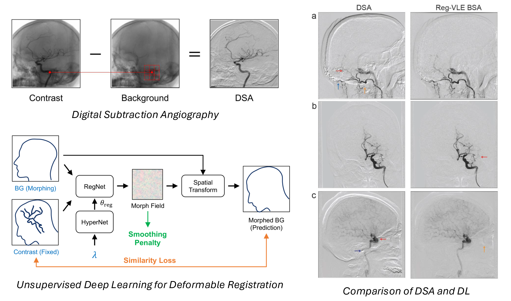

# HyperMorphBSA

## Summary Statement
We have implemented an unsupervised deep learning deformable registration framework utilizing a novel image similarity loss function to reduce the motion artifacts commonly encountered in digital subtraction angiography (DSA). The models available in the repo have been trained on a dataset with more than 5,000 angiographic series acquired in 2019. 

## Key Points
1.	A deep learning, fast, deformable registration model based on the HyperMorph framework is presented for head background subtraction angiography (BSA).
2.	We propose a novel image similarity loss function that evaluates the difference between the morphed background and fixed contrast frames after excluding an iteratively refined vessel layer estimate.
3.	Blinded neuroradiologist review demonstrates that our model reduces motion artifact and improves image quality, compared to traditional digital subtraction angiography and affine registration-based BSA.

## Model Implementation 

Please check more details in the [blog article](https://zcc861007.github.io/MyBlog/blog/unsup-dl-for-def-reg/#unsupervised-deep-learning-framework)

## Citation

**Reducing Motion Artifacts in Craniocervical Background Subtraction Angiography with Deformable Registration and Unsupervised Deep Learning**\
**Authors**: [Chaochao Zhou](https://zcc861007.github.io/MyBlog/), Ramez N. Abdalla, Dayeong An, Syed HA Faruqui, Teymour Sadrieh, Mohayad Al Zein, Rayan Nehme, Ali Shaibani, Sameer A. Ansari, Donald R. Cantrell\
**Journal**: *Radiology Advances*, Volume 1, Issue 3, September 2024\
**DOI**: https://doi.org/10.1093/radadv/umae020
